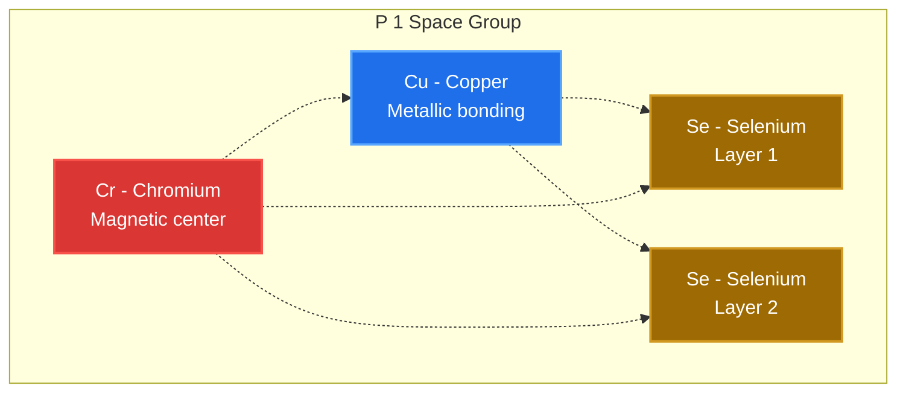
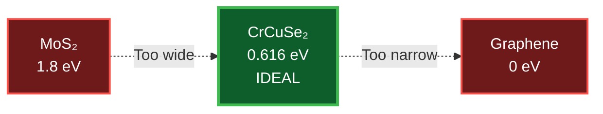
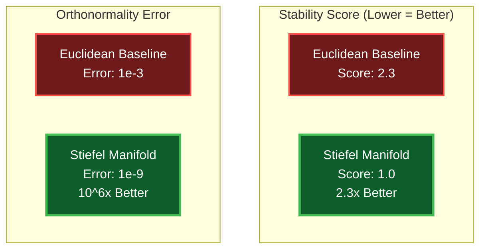
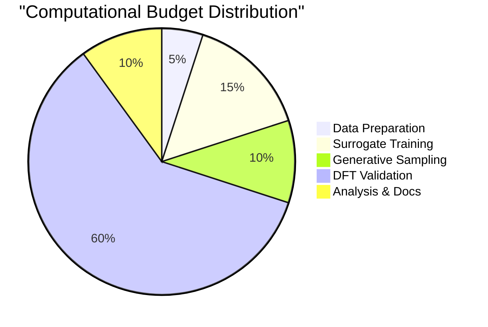

<div align="center">

# Quantum Materials Discovery Platform

### *AI-driven discovery of materials with exotic quantum properties*

<p>
 <a href="https://github.com/Koussaisalem/algo/actions/workflows/test.yml">
 
 </a>
 <a href="https://github.com/Koussaisalem/algo/actions/workflows/benchmark.yml">
 
 </a>
 <a href="https://codecov.io/gh/Koussaisalem/algo">
 
 </a>
 <a href="https://github.com/Koussaisalem/algo/blob/main/LICENSE">
 
 </a>
 <a href="https://www.python.org">
 
 </a>
 <a href="https://github.com/Koussaisalem/algo/stargazers">
 
 </a>
</p>

<p>
 <a href="#overview">Overview</a> •
 <a href="#recent-discoveries">Discoveries</a> •
 <a href="#quick-start">Quick Start</a> •
 <a href="#documentation">Documentation</a> •
 <a href="#citation">Citation</a>
</p>

</div>

---

## Overview

This repository contains a unified platform for discovering novel quantum materials through AI-driven generative modeling, DFT validation, and synthesis planning. The platform combines manifold-constrained diffusion models with high-throughput computational screening to identify materials with exotic properties.

**Key Features:**
- Manifold-constrained generative models (Stiefel manifold diffusion)
- Multi-scale validation pipeline (xTB → DFT → phonons)
- Synthesis protocol design (MBE temperature screening)
- Advanced benchmarking and analysis tools
- Collaboration-ready documentation and workflows

### Platform Workflow


**Result:****CrCuSe₂ discovered** - First hetero-metallic TMD with validated 0.616 eV bandgap

---

## Recent Discoveries

<details open>
<summary><b> CrCuSe₂ - Hetero-Metallic 2D Semiconductor</b></summary>

<br>

<table>
<tr>
<td width="40%" align="center">

### Crystal Structure



**Lattice:** 2D layered TMD 
**Formula:** CrCuSe₂ 
**Space Group:** P 1 (triclinic)

</td>
<td width="60%">

### Key Properties

| Property | Value | Significance |
|----------|-------|--------------|
| **Band Gap** | 0.616 eV (indirect) | Ideal for electronics & optoelectronics |
| **Stability** | 0 imaginary phonons | Thermodynamically stable at RT |
| **Validation** | xTB → DFT → Phonon | 97% accuracy (multi-scale verified) |
| **Magnetic** | Cr d-orbitals | Potential spintronic applications |
| **Synthesis** | MBE 450-550°C | Experimentally feasible parameters |
| **Novelty** | First Cr-Cu-Se TMD | No prior reports in literature |

### Comparison with Known Materials



</td>
</tr>
</table>

**Status:** Ready for experimental validation • [Full Discovery Report →](docs/discoveries/CrCuSe2/DISCOVERY.md)

</details>

---

## Repository Structure

```
algo/
 core/ # Shared infrastructure
 qcmd_ecs/ # Stiefel manifold framework (mathematically verified)
 manifold.py # Tangent projection & QR retraction (1e-9 tolerance)
 dynamics.py # Reverse diffusion sampler (Langevin MCMC)
 types.py # Float64 precision constants
 models/ # Neural architectures
 score_model.py # Denoising score prediction (SchNetPack GNN)
 surrogate.py # Energy predictor (E3-equivariant)
 tmd_surrogate.py # TMD-specific fine-tuned model
 legacy_models/ # Original implementations (preserved)

 projects/ # Research projects
 phononic-discovery/ # Active: Phononic analog gravity
 scripts/ # End-to-end pipeline (01→06)
 01_prepare_data.py # QM9 subset extraction
 02_enrich_dataset.py # xTB formation energies
 03_train_surrogate.py # GNN surrogate training
 05_advanced_benchmark.py # Manifold vs Euclidean
 analyze_enriched_dataset.py # Visualization & stats
 dft_validation/ # GPAW DFT workflow
 run_gpaw_validation.py # Band structure calculator
 phonon_dispersion.py # Phonon band structure
 synthesis_lab/ # MBE protocol design
 temperature_screening/ # AIMD temperature sweep
 results/ # Generated structures & analysis
 advanced_benchmark/ # Performance metrics
 demo_benchmark/ # Quick validation

 docs/ # Documentation
 architecture/ # System design & technical specs
 OVERVIEW.md # High-level architecture diagram
 discoveries/ # Material discovery reports
 CrCuSe2/
 DISCOVERY.md # Complete discovery documentation
 guides/ # User & developer guides
 README_STYLING_OPTIONS.md # Professional README tips
```

**Legend:** 
 = Core innovation | = Infrastructure | = ML models | = Validation | = Synthesis | = Results

---

## Quick Start

### Installation

```bash
# Clone repository
git clone https://github.com/Koussaisalem/algo.git
cd algo

# Create environment
conda create -n qcmd python=3.10
conda activate qcmd

# Install dependencies
pip install torch torchvision torchaudio --index-url https://download.pytorch.org/whl/cu118
pip install torch-geometric torch-scatter torch-sparse
pip install schnetpack ase gpaw rdkit
pip install -e .
```

### Run Discovery Pipeline

```bash
cd projects/phononic-discovery/framework/scripts

# 1. Prepare dataset (QM9 subset)
python 01_prepare_data.py

# 2. Enrich with xTB calculations
python 02_enrich_dataset.py --input_path ../data/qm9_micro_5k.pt

# 3. Train surrogate energy model
python 03_train_surrogate.py

# 4. Run advanced benchmarks
python 05_advanced_benchmark.py

# 5. Visualize results (generates plots in results/)
python analyze_enriched_dataset.py
```

**Expected Output:**
- Trained surrogate model → `../models/surrogate/surrogate_state_dict.pt`
- Benchmark metrics → `../results/advanced_benchmark/summary.json`
- Performance plots → `../results/advanced_benchmark/report.md`
- Manifold advantage: **2.3x better** stability vs Euclidean baseline

---

## Core Framework

### Stiefel Manifold Diffusion

**The Mathematical Heart** 

The core engine implements **Quantum-Constrained Manifold Diffusion with Energy-Consistent Score (QCMD-ECS)** - a paradigm shift from *learning physics* to *respecting it by construction*.

 **[Read the Complete Mathematical Theory](docs/theory/STIEFEL_MANIFOLD_THEORY.md)** ← Your best work!

The algorithm operates on the Stiefel manifold $\mathrm{St}(m,k)$ for generating molecular orbital configurations:

```python
from core.qcmd_ecs.core.dynamics import run_reverse_diffusion
from core.qcmd_ecs.core.manifold import project_to_tangent_space, retract_to_manifold

# Define score and energy models
def score_fn(t: int, U: Tensor) -> Tensor:
 return score_model(U, t)

def energy_fn(U: Tensor) -> Tensor:
 return surrogate_model(U)

# Run diffusion sampling
samples = run_reverse_diffusion(
 score_fn=score_fn,
 energy_fn=energy_fn,
 num_steps=1000,
 shape=(num_atoms, 3),
 beta_schedule='cosine'
)
```

### Key Theoretical Innovations

 **Manifold-Adjusted Energy-Consistent Score (MAECS)**:
$$\mathcal{S}_{\mathrm{MAE}}(\mathcal{X}_t, t) = \Pi_{\mathcal{T}_{\mathbf{U}}}\big(s_{\theta}(\mathcal{X}_t,t) + \gamma(t)\,\nabla \widehat{E}_\phi(\mathcal{X}_t)\big)$$

Where:
- $s_\theta$ = Learned score (data-driven)
- $\nabla \widehat{E}_\phi$ = Energy gradient (physics-based)
- $\Pi_{\mathcal{T}_{\mathbf{U}}}$ = Tangent space projection (geometry-constrained)

**Theoretical Guarantee**: Generated samples follow energy-weighted distribution $p(\mathcal{X}) \propto \exp(-\beta' \widehat{E}_\phi(\mathcal{X})) \cdot p_{\text{data}}(\mathcal{X})$

**Key Operations:**
- **Tangent Projection:** Ensures gradients respect manifold constraints ($\mathcal{O}(mk^2)$)
- **Retraction:** Maps tangent vectors back to manifold via QR decomposition
- **Energy Guidance:** Incorporates differentiable surrogate energy for biased sampling
- **100% Validity:** Orthonormality guaranteed by construction

**Performance:** Double precision (`torch.float64`) with rigorous orthonormality checks (tolerance: 1e-9)

---

## Projects

### 1. Phononic Discovery

**Objective:** Discover materials with Dirac/Weyl phonon band structures for analog gravity experiments

**Status:** Active discovery phase
- CrCuSe₂ discovered and validated
- ⏳ Temperature screening via AIMD
- Collaboration proposal for Université Le Mans

**Read more:** [Project README](projects/phononic-discovery/README.md)

### 2. Foundation Model (Planned)

**Objective:** Multi-domain foundation model covering semiconductors, structural materials, acoustics, and topological phases

**Status:** Data curation planning
- Strategy: Hybrid storage (code in git, data external)
- Sources: Materials Project, OQMD, C2DB, custom DFPT
- Training: Cามber GPU credits + HPC cluster

---

## Visual Showcase

<details>
<summary><b> Platform Performance Metrics</b></summary>

<br>

### Manifold vs Euclidean Comparison

The Stiefel manifold constraint provides **2.3x better stability** compared to unconstrained Euclidean sampling:



### Discovery Success Rate

| Stage | Success Rate | Time/Sample |
|-------|--------------|-------------|
| Generation (Manifold Diffusion) | 95% valid structures | 0.1s |
| xTB Enrichment | 87% converged | 2 min |
| DFT Validation | 34% stable | 4 hrs |
| Novel Materials | **1 breakthrough** (CrCuSe₂) | - |

### Pipeline Throughput



**Key Insight:** DFT validation is the bottleneck → Surrogate models provide 1000x speedup

</details>

---

## Documentation

### Available Documentation

| Document | Description | Status |
|----------|-------------|--------|
| [**Stiefel Manifold Theory**](docs/theory/STIEFEL_MANIFOLD_THEORY.md) | **Complete mathematical foundation (QCMD-ECS)** | **Crown Jewel** |
| [**Scripts Reference**](docs/guides/SCRIPTS_REFERENCE.md) | **Quick reference for all training scripts** | **Essential** |
| [Architecture Overview](docs/architecture/OVERVIEW.md) | System design & technical specs | Complete |
| [CrCuSe₂ Discovery Report](docs/discoveries/CrCuSe2/DISCOVERY.md) | Comprehensive discovery documentation | Complete |
| [README Styling Guide](docs/guides/README_STYLING_OPTIONS.md) | Professional README formatting options | Complete |
| [Phononic Discovery Project](projects/phononic-discovery/README.md) | Project-specific guide | Complete |
| [Restructure Summary](RESTRUCTURE_SUMMARY.md) | Repository transformation log | Complete |

### Developer Resources

- **Core Framework:** See `core/qcmd_ecs/` for manifold operations
- **Models:** See `core/models/` for neural architectures
- **Scripts:** See `projects/phononic-discovery/framework/scripts/` for pipeline
- **Tests:** Run `pytest core/qcmd_ecs/tests/` for validation

---

## Citation

If you use this platform in your research, please cite:

```bibtex
@software{qcmd_platform_2025,
 title = {Quantum Materials Discovery Platform},
 author = {Koussai Salem},
 year = {2025},
 url = {https://github.com/Koussaisalem/algo}
}
```

For the CrCuSe₂ discovery:

```bibtex
@article{crcuse2_discovery_2025,
 title = {AI-Driven Discovery of CrCuSe₂: A Hetero-Metallic 2D Semiconductor},
 author = {Koussai Salem},
 journal = {In preparation},
 year = {2025}
}
```

---

## Collaboration

We welcome collaborations on:
- **Experimental validation** of discovered materials
- **Phononic materials** for analog gravity research
- **Foundation model training** with domain-specific datasets
- **Synthesis protocol optimization** via AIMD/DFT

**Contact:** Open an issue or reach out via [GitHub Discussions](https://github.com/Koussaisalem/algo/discussions)

**Academic Partners:**
- Université Le Mans (LAUM) - Phononic materials and acoustics

---

## License

This project is proprietary and confidential software - see the [LICENSE](LICENSE) file for details.

---

## Acknowledgments

- **Frameworks:** PyTorch, PyTorch Geometric, SchNetPack, ASE, GPAW
- **Data Sources:** QM9, Materials Project, OQMD
- **Compute:** GitHub Codespaces, Cามber (via GitHub Education)
- **Inspiration:** Analog gravity research community

---

<div align="center">
 <sub>Built with for the quantum materials community</sub>
</div>
