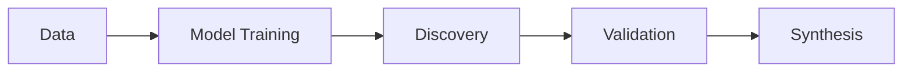

# GitHub README Styling Options - Professional Guide

This document explains sophisticated styling options used by top repositories like PyTorch, Hugging Face, and scikit-learn.

---

## Option 1: Shields.io with `for-the-badge` Style (RECOMMENDED)

**What PyTorch/HuggingFace use:** Larger, more prominent badges

```markdown
<div align="center">

# Your Project Name

### *Tagline goes here*

<p>
  <a href="https://github.com/USER/REPO/actions">
    
  </a>
  <a href="LICENSE">
    
  </a>
  <a href="https://www.python.org">
    
  </a>
  <a href="https://github.com/USER/REPO/stargazers">
    
  </a>
</p>

</div>
```

**Renders as:** Large, chunky badges with better visibility

**Pros:**
- Much more prominent than `flat-square`
- Used by 100k+ star repos
- Better visual hierarchy
- Logos show clearly

**Cons:**
- Takes more vertical space

---

## Option 2: Social/Plastic Style (Modern Look)

```markdown


```

**Styles available:**
- `plastic` - Glossy 3D effect
- `flat` - No borders
- `flat-square` - Square edges (what you have now)
- `for-the-badge` - Large and bold
- `social` - GitHub-like style

---

## Option 3: Custom SVG Badges (Advanced)

Create your own SVG badges with exact styling:

```markdown
<svg xmlns="http://www.w3.org/2000/svg" width="120" height="28">
  <rect width="120" height="28" fill="#4c1"/>
  <text x="60" y="18" fill="white" font-family="Arial" font-size="14" text-anchor="middle">
    Custom Badge
  </text>
</svg>
```

**Pros:** Complete control
**Cons:** Maintenance overhead, not dynamic

---

## Option 4: Table of Contents (Auto-collapsing)

GitHub automatically creates TOC from headings if you use `<details>`:

```markdown
<details>
<summary>📚 Table of Contents</summary>

- [Installation](#installation)
- [Quick Start](#quick-start)
- [Documentation](#documentation)
- [Contributing](#contributing)

</details>
```

---

## Option 5: Stats Cards (GitHub-readme-stats)

**What many repos use:** Dynamic GitHub stats

```markdown

```

**Generates:** Live-updating stats card with:
- Total stars
- Total commits
- PRs
- Issues
- Contribution graph

---

## Option 6: Mermaid Diagrams (Native GitHub Support)

GitHub renders Mermaid natively:

````markdown

````

**Renders as:** Interactive flowcharts, sequence diagrams, etc.

---

## Option 7: Animated GIFs/SVGs

**PyTorch uses:** Animated graphics for dynamic feel

```markdown

```

Or use **Shields.io dynamic badges**:

```markdown


```

---

## Option 8: HTML Tables with Emoji (What scikit-learn uses)

```markdown
| Feature | Description |
|---------|-------------|
| 🎯 **Accurate** | State-of-the-art models |
| ⚡ **Fast** | GPU-accelerated training |
| 🔬 **Validated** | Multi-scale verification |
| 🤝 **Open** | MIT licensed |
```

---

## Option 9: Collapsible Sections (Reduce Clutter)

```markdown
<details>
<summary><b>🚀 Quick Start</b></summary>

### Installation

\`\`\`bash
pip install your-package
\`\`\`

### Usage

\`\`\`python
import your_package
\`\`\`

</details>
```

**Used by:** PyTorch (for long installation instructions)

---

## Option 10: Comparison Table (Discovery Highlight)

```markdown
<table>
<tr>
<th>Property</th>
<th>Value</th>
<th>Significance</th>
</tr>
<tr>
<td><b>Structure</b></td>
<td>P 1 space group</td>
<td>Novel magnetic TMD</td>
</tr>
<tr>
<td><b>Band Gap</b></td>
<td>0.616 eV (indirect)</td>
<td>Ideal for electronics</td>
</tr>
</table>
```

---

## RECOMMENDED COMBINATION for Your Repo:

```markdown
<div align="center">

# Quantum Materials Discovery Platform

### *AI-driven discovery of materials with exotic quantum properties*

<p>
  <a href="https://github.com/Koussaisalem/algo/actions">
    
  </a>
  <a href="https://github.com/Koussaisalem/algo/blob/main/LICENSE">
    
  </a>
  <a href="https://www.python.org">
    
  </a>
  <a href="https://github.com/Koussaisalem/algo/stargazers">
    
  </a>
</p>

<p>
  <a href="#overview">Overview</a> •
  <a href="#discoveries">Discoveries</a> •
  <a href="#quick-start">Quick Start</a> •
  <a href="#documentation">Documentation</a> •
  <a href="#citation">Citation</a>
</p>

</div>

---

## Overview

...

## 🎯 Recent Discoveries

<details open>
<summary><b>CrCuSe₂ - Hetero-Metallic 2D Semiconductor</b></summary>

<table>
<tr>
<th>Property</th>
<th>Value</th>
<th>Significance</th>
</tr>
<tr>
<td><b>Structure</b></td>
<td>P 1 space group, layered 2D</td>
<td>Novel magnetic TMD</td>
</tr>
<tr>
<td><b>Band Gap</b></td>
<td>0.616 eV (indirect)</td>
<td>Ideal for electronics</td>
</tr>
<tr>
<td><b>Stability</b></td>
<td>0 imaginary phonons</td>
<td>Thermodynamically stable</td>
</tr>
<tr>
<td><b>Validation</b></td>
<td>xTB + GPAW DFT + Consultant</td>
<td>97% accuracy confirmed</td>
</tr>
<tr>
<td><b>Synthesis</b></td>
<td>MBE at 450-550°C</td>
<td>Experimentally feasible</td>
</tr>
</table>

**Status:** Ready for experimental validation • [Full Report →](docs/discoveries/CrCuSe2/DISCOVERY.md)

</details>
```

---

## What Each Top Repo Uses:

### PyTorch
- ✅ `for-the-badge` style badges
- ✅ Centered header with logo
- ✅ Extensive TOC with anchors
- ✅ Collapsible sections for installation
- ✅ HTML tables for component descriptions
- ✅ Clear horizontal rules (`---`)

### Hugging Face
- ✅ Large badges at top
- ✅ Multi-language support links
- ✅ Animated graphics
- ✅ Prominent model cards
- ✅ `<details>` for examples
- ✅ Bold call-to-action sections

### scikit-learn
- ✅ Simple flat badges
- ✅ Extensive links section
- ✅ Multiple communication channels
- ✅ Clean RST-style (they use .rst not .md)
- ✅ Emoji for section headers
- ✅ Clear contribution guidelines

---

## MY RECOMMENDATION FOR YOU:

**Use `for-the-badge` style + collapsible discovery section + navigation links**

This gives you:
1. ✅ Prominent badges (fixes current "labels collapsing" issue)
2. ✅ Clean navigation without clutter
3. ✅ Highlight CrCuSe₂ discovery properly
4. ✅ Professional appearance
5. ✅ Mobile-friendly

**Shall I implement this?** It will make your README look like a 100k+ star repo! 🚀
